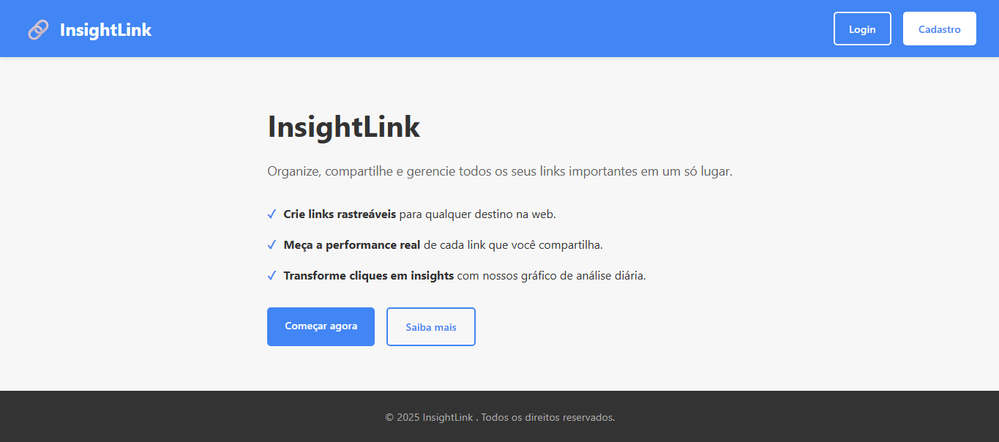

# InsightLink 


InsightLink não é um simples gerenciador de links. É uma plataforma de análise de performance que transforma cada link que você compartilha em uma fonte valiosa de dados e insights, permitindo que você entenda sua audiência e otimize suas estratégias.



---

## ✨ Funcionalidades Principais

* **👤 Gestão de Usuários:** Sistema completo de registro e login para que cada usuário tenha sua própria área segura.
* **🔗 Gerenciamento de Links:** Adicione, edite e organize todos os seus links de destino em um painel centralizado.
* **🚀 Criação de Links de Rastreamento:** Gere um link de rastreamento único para qualquer URL de destino.
* **📈 Rastreamento de Cliques:** Monitore cada clique em tempo real, coletando (até o momento) a métrica de quantidade de cliques por dia, quantidade de links e a quantidade total de cliques.
* **🎨 Gráficos Interativos:** Visualize a evolução dos cliques ao longo do tempo com gráfico de linha claro e intuitivo (powered by Chart.js).

---

## 🚀 Tecnologias Utilizadas

* **Backend:** PHP 8+ (Orientado a Objetos)
* **Banco de Dados:** MySQL (com PDO para conexões seguras)
* **Frontend:** HTML5, CSS3, JavaScript (Vanilla)
* **Gráficos:** [Chart.js](https://www.chartjs.org/)
* **Servidor Web:** Apache

---

## 🔧 Instalação e Configuração

Siga os passos abaixo para rodar o projeto em seu ambiente local.

### 📋 Pré-requisitos

* PHP 8.0 ou superior
* Servidor MySQL ou MariaDB
* Um servidor web como Apache ou XAMPP/WAMP

### Passos

1.  **Clone o repositório:**
    ```bash
    git clone [[https://github.com/micheltechEr/manager_links_track.git](https://github.com/micheltechEr/manager_links_track.git)](https://github.com/micheltechEr/manager_links_track.git)
    cd manager_links_track
    ```

2.  **Configure o Banco de Dados:**
    a. Crie um novo banco de dados no seu servidor MySQL/MariaDB.
    b. Importe a estrutura das tabelas. Execute o seguinte SQL:
    ```sql
    -- Tabela de Usuários
    CREATE TABLE `users` (
      `id` INT AUTO_INCREMENT PRIMARY KEY,
      `username` VARCHAR(50) NOT NULL UNIQUE,
      `password` VARCHAR(255) NOT NULL,
      `created_at` TIMESTAMP DEFAULT CURRENT_TIMESTAMP
    );

    -- Tabela de Links
    CREATE TABLE `links` (
      `id` INT AUTO_INCREMENT PRIMARY KEY,
      `user_id` INT NOT NULL,
      `title` VARCHAR(255) NOT NULL,
      `url_link` TEXT NOT NULL,
      `description` TEXT NULL,
      `is_active` TINYINT(1) NOT NULL DEFAULT 1,
      `created_at` TIMESTAMP DEFAULT CURRENT_TIMESTAMP,
      FOREIGN KEY (`user_id`) REFERENCES `users`(`id`) ON DELETE CASCADE
    );

    -- Tabela de Cliques (Rastreamento)
    CREATE TABLE `link_clicks` (
      `id` INT AUTO_INCREMENT PRIMARY KEY,
      `link_id` INT NOT NULL,
      `clicked_at` TIMESTAMP DEFAULT CURRENT_TIMESTAMP,
      `ip_address` VARCHAR(45) NULL,
      `user_agent` TEXT NULL,
      `referrer` TEXT NULL,
      FOREIGN KEY (`link_id`) REFERENCES `links`(`id`) ON DELETE CASCADE
    );
    ```

3.  **Configure as Credenciais:**
    a. Renomeie o arquivo `config/database.example.php` para `config/database.php`.
    b. Abra o novo arquivo `config/database.php` e edite as informações de conexão com o seu banco de dados:
    ```php
    define('DB_HOST', 'localhost');
    define('DB_NAME', 'nome_do_seu_banco');
    define('DB_USER', 'seu_usuario_do_banco');
    define('DB_PASS', 'sua_senha_do_banco');
    ```

4.  **Inicie o servidor:**
    Abra o projeto no seu navegador através do seu servidor local (ex: `http://localhost/manager_links_track`).

---

## 🎮 Como Usar

1.  Acesse a página inicial e crie uma conta.
2.  Faça login com suas novas credenciais.
3.  No seu painel, clique em "Adicionar Novo Link".
4.  Preencha o título e a URL de destino.
5.  O sistema irá gerar um link de rastreamento (ex: `.../redirect.php?id=XX`).
6.  Copie e compartilhe este novo link!
7.  Volte ao seu painel para acompanhar os resultados no dashboard geral.

---

## 💡 Ideias para o Futuro (To-Do)

* [ ] Customização de URLs de rastreamento (ex: `meusite.com/meu-link-custom`).
* [ ] Geolocalização dos cliques para exibir um mapa de visitantes.
* [ ] Agrupamento de links por tags ou pastas.
* [ ] Exportação de relatórios em formato CSV.
* [ ] Elaboração para estatísticas por links separados
* [ ] Visualização em período semanal, mensal e anual

---

## 📝 Licença

Este projeto está sob a licença MIT. Veja o arquivo [LICENSE.md](LICENSE.md) para mais detalhes.

---

## 👤 Autor

**[Seu Nome Aqui]**

* GitHub: [@seu-usuario](https://github.com/seu-usuario)
* LinkedIn: [Seu Perfil](https://linkedin.com/in/seu-perfil)
